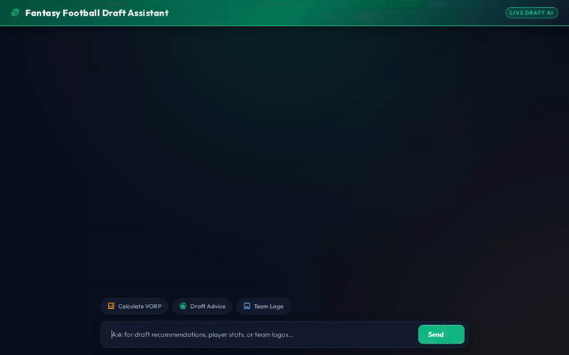

# 🏈 Fantasy Football Draft Assistant

An autonomous, AI-powered draft room assistant built with Google Agent Development Kit (ADK) and deployed to **Vertex AI Agent Engine**. Designed to assist fantasy football managers during live drafts with real-time Value Over Replacement Player (VORP) calculations, grounded expert advice, persistent draft tracking, custom logo generation, and rich visual A2UI cards.



---

## 🌟 Key Features

- 📊 **Dynamic VORP Calculator**: Safely executes Python code in an isolated **Agent Engine Sandbox** to calculate real-time Value Over Replacement Player (VORP) metrics tailored to your league's scoring rules.
- 🏈 **Persistent League & Roster Tracking**: Saves draft picks, roster status, and league configurations directly to **Google Cloud Firestore**.
- 📚 **RAG-Grounded Expert Strategy**: Retrieves up-to-date player projections and draft strategy insights grounded on expert cheat sheets using **Vertex AI RAG Engine**.
- 🎨 **AI Team Logo Generator**: Generates custom fantasy team logos on demand using `gemini-3.1-flash-lite-image`, uploading image bytes to a public **Google Cloud Storage** bucket and returning live HTTPS URLs.
- 🧠 **Cross-Session Memory Bank**: Remembers user preferences, draft strategies, target sleepers, and league rules across sessions using **Vertex AI Memory Bank**.
- 📱 **Interactive A2UI Cards**: Emits rich display UI (cards, structured columns, and embedded images) using **A2UI (v0.8 Basic Catalog)** rendered directly in a responsive, football-themed chat frontend.

---

## ☁️ Google Cloud Infrastructure & Architecture

| Google Cloud Tool / Service | Usage in Project |
| :--- | :--- |
| **Vertex AI Reasoning Engine** | Hosts the deployed ADK agent over the **A2A (Agent-to-Agent)** protocol. |
| **Vertex AI Memory Bank** | Manages persistent long-term user memories and draft preferences across conversations. |
| **Vertex AI RAG Engine** | Serverless vector corpus providing retrieval-augmented generation over expert draft guides. |
| **Google Cloud Firestore** | NoSQL database storing live league state, draft picks, and team rosters (`roles/datastore.user`). |
| **Google Cloud Storage** | Public bucket storing generated team logo image assets (`roles/storage.objectAdmin`). |
| **Agent Engine Code Sandbox** | `AgentEngineSandboxCodeExecutor` for safe execution of dynamic python analytics. |
| **Google Cloud Run** | Hosts the frontend chat interface and FastAPI proxy (`fantasy-football-frontend`). |

---

## 🚀 Quickstart & Local Development

### Prerequisites
- Python 3.11+
- `google-agents-cli`
- Google Cloud SDK (`gcloud`)

### 1. Run Agent Locally
```bash
# Start local ADK playground server
agents-cli playground
```

### 2. Run Frontend Locally
```bash
cd frontend
pip install -r requirements.txt

export AGENT_ENGINE_RESOURCE_NAME="projects/246011044791/locations/us-central1/reasoningEngines/5574213340789473280"
export AGENT_DIRECTORY="app"
export PORT=8080

python main.py
```
Open [http://localhost:8080](http://localhost:8080) to interact with the draft assistant!

---

## 🌐 Cloud Run Deployment

Deploy the frontend proxy to Cloud Run:
```bash
gcloud run deploy fantasy-football-frontend \
  --source ./frontend \
  --region us-central1 \
  --set-env-vars AGENT_ENGINE_RESOURCE_NAME="projects/246011044791/locations/us-central1/reasoningEngines/5574213340789473280",AGENT_DIRECTORY="app" \
  --allow-unauthenticated
```
